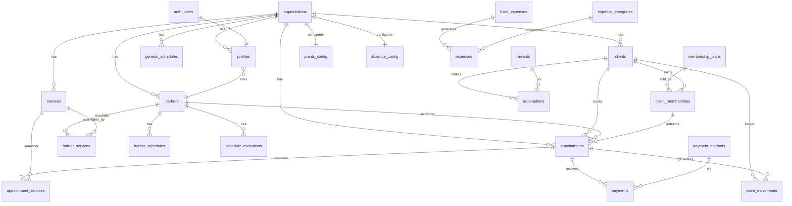
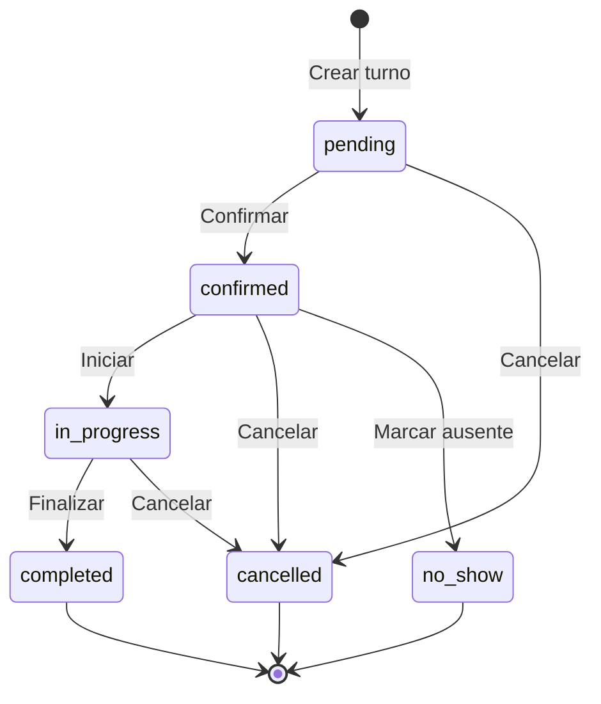
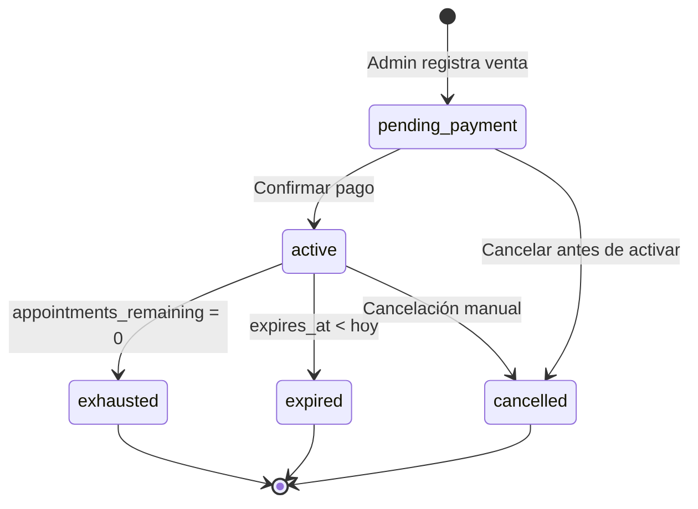
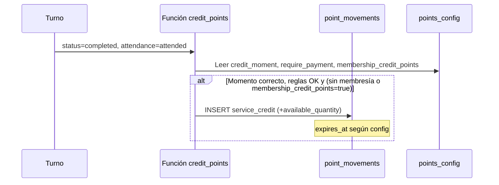

# Documento Técnico — Sistema de Gestión de Turnos para Barberías

**Proyecto:** Lomiva Barbería (reemplazo de AppSheet "Barbatero")  
**Versión del documento:** 1.2  
**Fecha:** 01/09/2026  
**Estado:** Análisis actualizado con decisiones de negocio — **no iniciar código hasta aprobación**

---

## Tabla de contenidos

1. [Resumen ejecutivo](#1-resumen-ejecutivo)
2. [Análisis del sistema actual (AppSheet)](#2-análisis-del-sistema-actual-appsheet)
3. [Arquitectura propuesta](#3-arquitectura-propuesta)
4. [Modelo de datos](#4-modelo-de-datos)
5. [Relaciones entre tablas](#5-relaciones-entre-tablas)
6. [Roles y permisos](#6-roles-y-permisos)
7. [Reglas de negocio](#7-reglas-de-negocio)
8. [Flujo de turnos](#8-flujo-de-turnos)
9. [Flujo de pagos](#9-flujo-de-pagos)
10. [Flujo de membresías](#10-flujo-de-membresías)
11. [Flujo de puntos y premios](#11-flujo-de-puntos-y-premios)
12. [Motor de disponibilidad](#12-motor-de-disponibilidad)
13. [Portal del cliente](#13-portal-del-cliente)
14. [Etapas de implementación](#14-etapas-de-implementación)
15. [Riesgos y ambigüedades](#15-riesgos-y-ambigüedades)
16. [Criterios de aceptación por módulo](#16-criterios-de-aceptación-por-módulo)
17. [Costos potenciales](#17-costos-potenciales)
18. [Migración desde AppSheet](#18-migración-desde-appsheet)

---

## 1. Resumen ejecutivo

Se propone reemplazar la aplicación **Barbatero** (AppSheet) por una aplicación web moderna, multi-tenant, responsive e instalable como PWA. El stack principal será **React + TypeScript + Vite + Tailwind + shadcn/ui** en el frontend y **Supabase** (PostgreSQL, Auth, Storage, RLS, Edge Functions selectivas) en el backend.

El desarrollo se realizará **íntegramente en local** hasta que el sistema esté validado. No se hará push, deploy ni conexión a Supabase remoto sin autorización explícita.

### Decisiones arquitectónicas clave

| Decisión | Elección | Motivo |
|----------|----------|--------|
| Multi-tenancy | `organization_id` en todas las tablas de negocio + RLS | Aislamiento total entre barberías |
| Claves primarias | UUID v4 (`gen_random_uuid()`) | Sin exposición de secuencias ni datos visibles |
| Zona horaria | UTC en BD; `America/Argentina/Buenos_Aires` en UI | Consistencia y localización |
| Disponibilidad | Funciones PostgreSQL + validación transaccional | No confiar en el navegador |
| Puntos | Libro mayor (ledger) con FEFO | Integridad y trazabilidad |
| Totales históricos | Congelados en `appointment_services` y campos del turno | Inmutabilidad de registros pasados |
| Auth | Supabase Auth + tabla `profiles` | Roles y permisos en BD, no en JWT editable |
| Membresías AppSheet | Módulo independiente (`membership_plans` + `client_memberships`) | Compra aparte; X turnos en Y tiempo — no es puntos |
| Puntos / premios | Módulo separado de membresías | Acumulación por servicios + canje de premios |
| Migración inicial | Organización **Barbatero**, barbero **Gian Anibaldi** | Único sistema AppSheet activo hoy |
| Reservas portal | Configurable por barbería + override por cliente | 3 modos globales (ver §7.13) |
| Pagos | Sin excedente; autocompletar saldo pendiente | Descuento siempre sobre subtotal congelado |
| Barbero | Solo crea turnos para sí mismo | Confirmado |

### Decisiones de negocio confirmadas (v1.1)

| Tema | Decisión |
|------|----------|
| Migración | Vinculada a barbería **Barbatero**; turnos históricos asignados a **Gian Anibaldi** |
| Membresías vs puntos | **Sistemas independientes**. Membresía = paquete comprado con N turnos válidos por X tiempo. Puntos = acumulación por servicios + canje de premios |
| Barbero crea turnos | **Solo para sí mismo** (`barber_id` = barbero del perfil) |
| Descuento por método | **Sobre subtotal** congelado del turno |
| Pago excedido | **No permitido**. Al registrar pago, autocompletar con saldo pendiente |
| Portal cliente — reservas | Tres modos globales + override individual por cliente (ver §7.13) |
| Puntos en turnos con membresía | **Configurable por barbería** (`membership_credit_points`) | Cada org elige si suman o no |
| Decremento de turno de membresía | **Al crear el turno** (`on_create`) | Confirmado |

---

## 2. Análisis del sistema actual (AppSheet)

### 2.1 Tablas existentes mapeadas

| Tabla AppSheet | Propósito actual | Equivalente propuesto |
|----------------|------------------|----------------------|
| **Clientes** | Nombre, apodo, teléfono, email, flag múltiples turnos | `clients` |
| **Servicios** | Nombre, duración, valor, valor efectivo | `services` + overrides por barbero |
| **Turnos** | Cliente, fecha, hora, servicio, valor, asistencia, membresía | `appointments` + `appointment_services` |
| **Horarios** | Catálogo de franjas horarias (Time) | `general_schedules` (por día de semana) |
| **Disponibilidad** | Día → lista de horarios disponibles | Calculado dinámicamente (no tabla estática) |
| **Pagos** | Turno, monto, método, comprobante | `payments` |
| **Membresías** | Planes: nombre, cantidad turnos, meses, valor | `membership_plans` |
| **Membresías Activas** | Instancia por cliente con turnos restantes y vencimiento | `client_memberships` |
| **Gastos Fijos** | Ítem, monto, desde, estado, último mes | `fixed_expenses` |
| **Gastos Mensuales** | Ítem, monto, fecha | `expenses` |
| **Cancelar Agenda** | Bloqueo por día o rango | `schedule_exceptions` |
| **Balance** | Vista calculada (filtros + KPIs) | Queries/vistas en frontend + funciones SQL |
| **Días, Meses, Filtro Turnos** | Auxiliares de UI | Eliminados; lógica en aplicación |

### 2.2 Diferencias importantes respecto al nuevo diseño

1. **AppSheet no tiene barberos** como entidad. El nuevo sistema los introduce como requisito central. La migración inicial asignará todos los turnos históricos a **Gian Anibaldi** (único barbero activo en Barbatero).
2. **Membresías por paquete de turnos** se mantienen como módulo **independiente** del sistema de puntos/premios. Son productos comprados aparte con N turnos canjeables en un período.
3. **Disponibilidad estática** (tabla Día → Horarios) se reemplaza por **motor dinámico** que considera duración de servicios, bloqueos, turnos existentes y horarios por barbero.
4. **Valor en efectivo** en servicios se modelará como **método de pago con descuento** (no como precio duplicado en servicio).
5. **Sin multi-tenant** en AppSheet; el nuevo sistema lo exige desde el diseño (MVP con una sola org: Barbatero).

### 2.3 Funcionalidades a preservar conceptualmente

- Creación de turnos con validación de disponibilidad
- Registro de asistencia/ausencia
- Pagos múltiples por turno con métodos y descuentos
- Gastos fijos con generación mensual idempotente
- Balance con producción vs caja
- Bloqueo de agenda (días/rangos)
- Advertencia por inasistencias del cliente
- Membresías comprables (paquetes de turnos con vencimiento)
- Sistema de puntos y premios (independiente de membresías)
- Exportación de datos (Excel en lugar de Google Sheets)

---

## 3. Arquitectura propuesta

### 3.1 Diagrama de alto nivel

```
┌─────────────────────────────────────────────────────────────────────┐
│                         CLIENTES FINALES                             │
│  ┌──────────────┐  ┌──────────────┐  ┌──────────────────────────┐  │
│  │ PWA React    │  │ Portal       │  │ Admin / Barbero          │  │
│  │ (Responsive) │  │ Cliente      │  │ (FullCalendar, Balance)  │  │
│  └──────┬───────┘  └──────┬───────┘  └──────────┬───────────────┘  │
└─────────┼─────────────────┼─────────────────────┼───────────────────┘
          │                 │                     │
          ▼                 ▼                     ▼
┌─────────────────────────────────────────────────────────────────────┐
│                    CAPA DE APLICACIÓN (Frontend)                     │
│  React 19 + TypeScript (strict) + Vite                              │
│  TanStack Query │ React Hook Form + Zod │ date-fns (tz: BA)         │
│  shadcn/ui + Tailwind │ Lucide Icons │ PWA (vite-plugin-pwa)        │
└─────────────────────────────┬───────────────────────────────────────┘
                              │ supabase-js (anon key)
                              ▼
┌─────────────────────────────────────────────────────────────────────┐
│                         SUPABASE                                     │
│  ┌─────────────┐  ┌──────────────┐  ┌────────────┐  ┌───────────┐  │
│  │ Auth        │  │ PostgreSQL   │  │ Storage    │  │ Edge Fn   │  │
│  │ (email/pwd) │  │ + RLS        │  │ (comprob., │  │ (OTP,     │  │
│  │             │  │ + Functions  │  │  premios)  │  │  rate lim)│  │
│  └─────────────┘  └──────────────┘  └────────────┘  └───────────┘  │
└─────────────────────────────────────────────────────────────────────┘
                              │
                              ▼ (futuro, con autorización)
┌─────────────────────────────────────────────────────────────────────┐
│  Vercel (hosting estático/SSR) │ Supabase Cloud (prod)               │
└─────────────────────────────────────────────────────────────────────┘
```

### 3.2 Estructura de carpetas propuesta

```
barberia/
├── docs/
│   └── DOCUMENTO_TECNICO.md
├── supabase/
│   ├── config.toml
│   ├── migrations/          # SQL versionado
│   ├── functions/           # Edge Functions (OTP, exports pesados)
│   └── seed.sql             # Datos de demostración
├── src/
│   ├── app/                 # Rutas y layouts
│   ├── components/          # UI (shadcn) + dominio
│   ├── features/            # Módulos por dominio
│   │   ├── auth/
│   │   ├── appointments/
│   │   ├── availability/
│   │   ├── clients/
│   │   ├── barbers/
│   │   ├── services/
│   │   ├── schedules/
│   │   ├── payments/
│   │   ├── memberships/
│   │   ├── points/
│   │   ├── rewards/
│   │   ├── expenses/
│   │   ├── balance/
│   │   ├── exports/
│   │   └── client-portal/
│   ├── hooks/
│   ├── lib/                 # supabase client, utils, constants
│   ├── types/               # Tipos generados + dominio
│   └── test/                # setup Vitest
├── e2e/                     # Playwright
├── public/
├── .env.example
├── package.json
├── vite.config.ts
├── tailwind.config.ts
└── tsconfig.json
```

### 3.3 Capas de seguridad

| Capa | Responsabilidad |
|------|-----------------|
| **RLS (PostgreSQL)** | Filtrado por `organization_id`, rol y barbero |
| **Funciones SECURITY DEFINER** | Operaciones transaccionales (turnos, puntos, pagos) en schema `private` |
| **Zod (frontend + Edge)** | Validación de entrada |
| **Supabase Auth** | Sesiones JWT; roles en `profiles`, no en `user_metadata` |
| **Storage policies** | Buckets por organización; acceso por rol |
| **Rate limiting** | Portal cliente vía Edge Function + tabla de intentos |

### 3.4 Entorno local (fase inicial)

```bash
# Desarrollo sin Supabase remoto
supabase start          # PostgreSQL + Auth + Storage local (Docker)
npm run dev             # Vite dev server
supabase db reset       # Migraciones + seed
```

Variables en `.env.local` (nunca commitear):

```
VITE_SUPABASE_URL=http://127.0.0.1:54321
VITE_SUPABASE_ANON_KEY=<anon key local>
SUPABASE_SERVICE_ROLE_KEY=<solo backend/scripts, nunca en frontend>
VITE_APP_TIMEZONE=America/Argentina/Buenos_Aires
```

### 3.5 Generación de tipos

Tipos TypeScript generados desde el esquema Supabase:

```bash
supabase gen types typescript --local > src/types/database.generated.ts
```

---

## 4. Modelo de datos

Convenciones globales:
- PK: `id UUID PRIMARY KEY DEFAULT gen_random_uuid()`
- FK: `{entity}_id UUID REFERENCES {entity}(id)`
- Timestamps: `created_at TIMESTAMPTZ DEFAULT now()`, `updated_at TIMESTAMPTZ DEFAULT now()`
- Soft delete: `is_active BOOLEAN DEFAULT true`, `deleted_at TIMESTAMPTZ`, `deleted_by UUID`
- Moneda: `NUMERIC(12,2)` — nunca `float`
- Duración: `INTEGER` (minutos)
- Teléfono: `phone_normalized VARCHAR(20)` (solo dígitos + prefijo) + `phone_display VARCHAR(30)`

### 4.1 Enums (schema `public`)

```sql
CREATE TYPE user_role AS ENUM ('admin', 'barber');
CREATE TYPE appointment_status AS ENUM ('pending', 'confirmed', 'in_progress', 'completed', 'cancelled', 'no_show');
CREATE TYPE attendance_status AS ENUM ('pending', 'attended', 'no_show', 'cancelled_early', 'cancelled_late', 'rescheduled');
CREATE TYPE payment_status AS ENUM ('pending', 'partial', 'paid', 'refunded');
CREATE TYPE portal_booking_mode AS ENUM ('all_except_denied', 'allowlist_only', 'disabled');
CREATE TYPE client_booking_override AS ENUM ('inherit', 'allowed', 'denied');
CREATE TYPE client_membership_status AS ENUM ('pending_payment', 'active', 'exhausted', 'expired', 'cancelled');
CREATE TYPE discount_type AS ENUM ('none', 'percentage', 'fixed');
CREATE TYPE point_movement_type AS ENUM (
  'service_credit', 'redemption', 'expiration', 'manual_credit',
  'manual_debit', 'cancellation_reversal', 'redemption_reversal'
);
CREATE TYPE point_credit_moment AS ENUM ('on_create', 'on_confirm', 'on_complete', 'on_payment');
CREATE TYPE expiration_type AS ENUM ('none', 'days', 'months');
CREATE TYPE reward_type AS ENUM ('percentage_discount', 'fixed_discount', 'free_service', 'physical_prize', 'custom_benefit');
CREATE TYPE redemption_status AS ENUM ('requested', 'approved', 'used', 'delivered', 'cancelled', 'expired');
CREATE TYPE expense_type AS ENUM ('general', 'from_fixed');
CREATE TYPE absence_rule_type AS ENUM ('consecutive', 'within_period');
CREATE TYPE absence_period_unit AS ENUM ('days', 'weeks', 'months');
CREATE TYPE schedule_exception_scope AS ENUM ('organization', 'barber');
CREATE TYPE schedule_exception_type AS ENUM ('block', 'allow'); -- block = negativo, allow = excepción positiva
CREATE TYPE audit_action AS ENUM ('create', 'update', 'delete', 'status_change', 'soft_delete');
CREATE TYPE creation_channel AS ENUM ('admin', 'barber', 'client_portal', 'import');
```

### 4.2 Tablas principales

#### `organizations`

| Columna | Tipo | Notas |
|---------|------|-------|
| id | UUID | PK |
| name | TEXT | NOT NULL |
| logo_url | TEXT | Storage path |
| phone | TEXT | |
| address | TEXT | |
| timezone | TEXT | DEFAULT 'America/Argentina/Buenos_Aires' |
| currency | TEXT | DEFAULT 'ARS' |
| settings | JSONB | Config general (ver §7) |
| is_active | BOOLEAN | DEFAULT true |
| created_at, updated_at | TIMESTAMPTZ | |

#### `profiles`

| Columna | Tipo | Notas |
|---------|------|-------|
| id | UUID | PK, FK → auth.users(id) ON DELETE CASCADE |
| organization_id | UUID | FK → organizations, NOT NULL |
| role | user_role | NOT NULL |
| barber_id | UUID | FK → barbers, nullable |
| full_name | TEXT | |
| permissions | JSONB | `{ can_register_payments, can_edit_own_schedule }` |
| is_active | BOOLEAN | |
| created_at, updated_at | TIMESTAMPTZ | |

#### `barbers`

| Columna | Tipo | Notas |
|---------|------|-------|
| id | UUID | PK |
| organization_id | UUID | FK, NOT NULL |
| user_id | UUID | FK → auth.users, nullable |
| name | TEXT | NOT NULL |
| photo_url | TEXT | |
| phone, email | TEXT | |
| calendar_color | TEXT | Hex, ej. `#3B82F6` |
| use_general_schedules | BOOLEAN | DEFAULT true |
| use_general_services | BOOLEAN | DEFAULT true |
| use_general_prices | BOOLEAN | DEFAULT true |
| use_general_durations | BOOLEAN | DEFAULT true |
| display_order | INTEGER | Para asignación "cualquier barbero" |
| is_active, deleted_at, deleted_by | | Soft delete |

#### `clients`

| Columna | Tipo | Notas |
|---------|------|-------|
| id | UUID | PK |
| organization_id | UUID | FK, NOT NULL |
| first_name, last_name | TEXT | NOT NULL |
| phone_normalized | TEXT | NOT NULL, indexado |
| phone_display | TEXT | |
| email | TEXT | |
| birth_date | DATE | Opcional |
| notes | TEXT | |
| manual_warning | BOOLEAN | DEFAULT false |
| manual_warning_reason | TEXT | |
| booking_override | client_booking_override | DEFAULT 'inherit' — ver §7.13 |
| registered_at | TIMESTAMPTZ | DEFAULT now() |
| is_active, deleted_at, deleted_by | | |

**Índice único:** `(organization_id, phone_normalized) WHERE deleted_at IS NULL`

#### `services`

| Columna | Tipo | Notas |
|---------|------|-------|
| id | UUID | PK |
| organization_id | UUID | FK |
| name | TEXT | NOT NULL |
| description | TEXT | |
| price | NUMERIC(12,2) | NOT NULL |
| duration_minutes | INTEGER | NOT NULL |
| points_awarded | INTEGER | DEFAULT 0 |
| display_order | INTEGER | |
| category_color | TEXT | Opcional |
| is_active, deleted_at, deleted_by | | |

#### `barber_services` (overrides)

| Columna | Tipo | Notas |
|---------|------|-------|
| id | UUID | PK |
| organization_id | UUID | FK |
| barber_id | UUID | FK → barbers |
| service_id | UUID | FK → services, nullable si exclusivo |
| is_enabled | BOOLEAN | DEFAULT true |
| is_exclusive | BOOLEAN | DEFAULT false |
| exclusive_name | TEXT | Solo si exclusivo |
| price_override | NUMERIC(12,2) | NULL = hereda |
| duration_override | INTEGER | NULL = hereda |
| points_override | INTEGER | NULL = hereda |
| exclusive_price, exclusive_duration, exclusive_points | | Para servicios exclusivos |

**Regla:** Si `service_id` IS NOT NULL y `is_exclusive = false` → override parcial. Si `is_exclusive = true` → servicio propio del barbero.

#### `general_schedules`

| Columna | Tipo | Notas |
|---------|------|-------|
| id | UUID | PK |
| organization_id | UUID | FK |
| day_of_week | INTEGER | 0=Dom … 6=Sáb (ISO: 1=Lun, documentar convención) |
| start_time | TIME | NOT NULL |
| end_time | TIME | NOT NULL |
| is_active | BOOLEAN | |

Múltiples filas por día permitidas (bloques separados).

#### `barber_schedules`

| Columna | Tipo | Notas |
|---------|------|-------|
| id | UUID | PK |
| organization_id | UUID | FK |
| barber_id | UUID | FK |
| day_of_week | INTEGER | |
| start_time, end_time | TIME | |
| is_working_day | BOOLEAN | false = día no laborable explícito |
| is_active | BOOLEAN | |

Si `barber.use_general_schedules = true` y no hay filas para un día → usar `general_schedules`.

#### `schedule_exceptions`

| Columna | Tipo | Notas |
|---------|------|-------|
| id | UUID | PK |
| organization_id | UUID | FK |
| barber_id | UUID | NULL = toda la org |
| exception_type | schedule_exception_type | block / allow |
| scope | schedule_exception_scope | |
| start_date | DATE | NOT NULL |
| end_date | DATE | NOT NULL |
| start_time, end_time | TIME | NULL = día completo |
| reason | TEXT | |
| is_active | BOOLEAN | |

#### `appointments`

| Columna | Tipo | Notas |
|---------|------|-------|
| id | UUID | PK |
| organization_id | UUID | FK |
| client_id | UUID | FK |
| barber_id | UUID | FK |
| starts_at | TIMESTAMPTZ | UTC |
| ends_at | TIMESTAMPTZ | UTC |
| total_duration_minutes | INTEGER | Congelado |
| subtotal | NUMERIC(12,2) | Congelado |
| discount_amount | NUMERIC(12,2) | DEFAULT 0 |
| total_amount | NUMERIC(12,2) | Congelado |
| status | appointment_status | |
| attendance_status | attendance_status | |
| client_membership_id | UUID | FK → client_memberships, nullable — turno canjeado con membresía |
| membership_turns_consumed | INTEGER | DEFAULT 0 — turnos de membresía consumidos (normalmente 0 o 1) |
| is_overbooking | BOOLEAN | DEFAULT false |
| overbooking_reason | TEXT | |
| overbooking_created_by | UUID | |
| notes | TEXT | |
| creation_channel | creation_channel | |
| created_by | UUID | |
| cancelled_at, cancelled_by, cancellation_reason | | |
| is_active, deleted_at, deleted_by | | |

**Constraint anti-solapamiento** (excluye cancelados y sobreturnos):

```sql
-- Usar extensión btree_gist + EXCLUDE constraint
EXCLUDE USING gist (
  barber_id WITH =,
  tstzrange(starts_at, ends_at, '[)') WITH &&
) WHERE (
  status NOT IN ('cancelled') AND is_overbooking = false AND deleted_at IS NULL
);
```

#### `appointment_services`

| Columna | Tipo | Notas |
|---------|------|-------|
| id | UUID | PK |
| organization_id | UUID | FK |
| appointment_id | UUID | FK |
| service_id | UUID | FK, nullable si servicio eliminado |
| service_name | TEXT | Congelado |
| price_applied | NUMERIC(12,2) | Congelado |
| duration_applied | INTEGER | Congelado |
| points_applied | INTEGER | Congelado |
| sort_order | INTEGER | |

#### `appointment_status_history`

| Columna | Tipo | Notas |
|---------|------|-------|
| id | UUID | PK |
| organization_id | UUID | FK |
| appointment_id | UUID | FK |
| previous_status | appointment_status | |
| new_status | appointment_status | |
| previous_attendance | attendance_status | |
| new_attendance | attendance_status | |
| changed_by | UUID | |
| reason | TEXT | |
| created_at | TIMESTAMPTZ | |

#### `payment_methods`

| Columna | Tipo | Notas |
|---------|------|-------|
| id | UUID | PK |
| organization_id | UUID | FK |
| name | TEXT | ej. "Efectivo", "Transferencia" |
| discount_type | discount_type | |
| discount_value | NUMERIC(12,2) | |
| auto_apply_discount | BOOLEAN | DEFAULT true |
| display_order | INTEGER | |
| is_active | BOOLEAN | |

#### `payments`

| Columna | Tipo | Notas |
|---------|------|-------|
| id | UUID | PK |
| organization_id | UUID | FK |
| appointment_id | UUID | FK |
| client_id | UUID | FK |
| barber_id | UUID | FK |
| amount | NUMERIC(12,2) | NOT NULL |
| discount_applied | NUMERIC(12,2) | DEFAULT 0 |
| payment_method_id | UUID | FK |
| status | payment_status | |
| paid_at | TIMESTAMPTZ | Fecha efectiva de caja |
| notes | TEXT | |
| receipt_url | TEXT | Storage |
| recorded_by | UUID | |
| is_active, deleted_at, deleted_by | | |

#### `membership_plans` (catálogo — equivalente AppSheet "Membresías")

| Columna | Tipo | Notas |
|---------|------|-------|
| id | UUID | PK |
| organization_id | UUID | FK |
| name | TEXT | NOT NULL |
| description | TEXT | |
| price | NUMERIC(12,2) | Precio de compra del paquete |
| appointments_included | INTEGER | Cantidad de turnos incluidos |
| validity_months | INTEGER | Meses de vigencia desde activación |
| allowed_service_ids | UUID[] | Opcional: servicios canjeables; NULL = todos |
| display_order | INTEGER | |
| is_active, deleted_at, deleted_by | | |

#### `client_memberships` (instancias — equivalente AppSheet "Membresías Activas")

| Columna | Tipo | Notas |
|---------|------|-------|
| id | UUID | PK |
| organization_id | UUID | FK |
| client_id | UUID | FK → clients |
| membership_plan_id | UUID | FK → membership_plans, nullable si plan eliminado |
| plan_name | TEXT | Congelado al comprar |
| price_paid | NUMERIC(12,2) | Congelado |
| appointments_total | INTEGER | Congelado |
| appointments_remaining | INTEGER | Decrementa al canjear turno |
| payment_confirmed | BOOLEAN | DEFAULT false |
| starts_at | DATE | Fecha de inicio |
| expires_at | DATE | Calculado: fin de mes según regla AppSheet (EOMONTH) |
| status | client_membership_status | |
| purchased_at | TIMESTAMPTZ | |
| purchased_by | UUID | Usuario que registró la venta |
| notes | TEXT | |
| is_active, deleted_at, deleted_by | | |

**Índice:** `(client_id, status) WHERE status = 'active'` para consultas rápidas.

#### `points_config`

| Columna | Tipo | Notas |
|---------|------|-------|
| id | UUID | PK |
| organization_id | UUID | FK, UNIQUE |
| enabled | BOOLEAN | DEFAULT true |
| expiration_type | expiration_type | |
| expiration_value | INTEGER | Días o meses |
| credit_moment | point_credit_moment | DEFAULT 'on_complete' |
| require_payment_for_credit | BOOLEAN | DEFAULT false |

#### `point_movements` (ledger)

| Columna | Tipo | Notas |
|---------|------|-------|
| id | UUID | PK |
| organization_id | UUID | FK |
| client_id | UUID | FK |
| appointment_id | UUID | nullable |
| redemption_id | UUID | nullable |
| movement_type | point_movement_type | |
| quantity | INTEGER | Positivo o negativo |
| available_quantity | INTEGER | Saldo del lote (FEFO) |
| expires_at | TIMESTAMPTZ | nullable |
| reason | TEXT | |
| created_by | UUID | |
| created_at | TIMESTAMPTZ | |

#### `point_consumption_details` (trazabilidad FEFO)

| Columna | Tipo | Notas |
|---------|------|-------|
| id | UUID | PK |
| debit_movement_id | UUID | FK → point_movements |
| credit_movement_id | UUID | FK → point_movements (lote consumido) |
| quantity | INTEGER | |

#### `rewards`

| Columna | Tipo | Notas |
|---------|------|-------|
| id | UUID | PK |
| organization_id | UUID | FK |
| name, description | TEXT | |
| image_url | TEXT | |
| points_required | INTEGER | |
| reward_type | reward_type | |
| value | NUMERIC(12,2) | Según tipo |
| service_id | UUID | nullable |
| stock | INTEGER | nullable = ilimitado |
| starts_at, ends_at | TIMESTAMPTZ | |
| max_per_client | INTEGER | nullable |
| is_active | BOOLEAN | |

#### `redemptions`

| Columna | Tipo | Notas |
|---------|------|-------|
| id | UUID | PK |
| organization_id | UUID | FK |
| client_id | UUID | FK |
| reward_id | UUID | FK |
| points_used | INTEGER | |
| unique_code | TEXT | UNIQUE por org |
| status | redemption_status | |
| appointment_id | UUID | nullable |
| approved_by, delivered_by | UUID | |
| delivered_at | TIMESTAMPTZ | |
| notes | TEXT | |
| created_at | TIMESTAMPTZ | |

#### `expense_categories`

| Columna | Tipo | Notas |
|---------|------|-------|
| id | UUID | PK |
| organization_id | UUID | FK |
| name | TEXT | |
| is_active | BOOLEAN | |

#### `expenses`

| Columna | Tipo | Notas |
|---------|------|-------|
| id | UUID | PK |
| organization_id | UUID | FK |
| category_id | UUID | FK |
| description | TEXT | |
| amount | NUMERIC(12,2) | |
| expense_date | DATE | Imputación |
| expense_type | expense_type | |
| fixed_expense_id | UUID | nullable |
| barber_id | UUID | nullable |
| receipt_url | TEXT | |
| notes | TEXT | |
| idempotency_key | TEXT | UNIQUE, para gastos fijos |
| is_active, deleted_at, deleted_by | | |

#### `fixed_expenses`

| Columna | Tipo | Notas |
|---------|------|-------|
| id | UUID | PK |
| organization_id | UUID | FK |
| category_id | UUID | FK |
| name | TEXT | |
| amount | NUMERIC(12,2) | |
| imputation_day | INTEGER | 1-28 |
| start_date | DATE | |
| end_date | DATE | nullable |
| auto_generate | BOOLEAN | DEFAULT true |
| is_active | BOOLEAN | |

#### `absence_config`

| Columna | Tipo | Notas |
|---------|------|-------|
| id | UUID | PK |
| organization_id | UUID | FK, UNIQUE |
| threshold_count | INTEGER | |
| rule_type | absence_rule_type | |
| period_value | INTEGER | |
| period_unit | absence_period_unit | |
| counting_statuses | attendance_status[] | DEFAULT '{no_show}' |
| is_active | BOOLEAN | |

#### `audit_log`

| Columna | Tipo | Notas |
|---------|------|-------|
| id | UUID | PK |
| organization_id | UUID | FK |
| entity_type | TEXT | |
| entity_id | UUID | |
| action | audit_action | |
| old_values | JSONB | |
| new_values | JSONB | |
| reason | TEXT | |
| performed_by | UUID | |
| created_at | TIMESTAMPTZ | |

#### `client_portal_sessions`

| Columna | Tipo | Notas |
|---------|------|-------|
| id | UUID | PK |
| organization_id | UUID | FK |
| client_id | UUID | FK |
| token_hash | TEXT | |
| expires_at | TIMESTAMPTZ | |
| created_at | TIMESTAMPTZ | |

#### `client_portal_otp`

| Columna | Tipo | Notas |
|---------|------|-------|
| id | UUID | PK |
| organization_id | UUID | FK |
| phone_normalized | TEXT | |
| code_hash | TEXT | |
| attempts | INTEGER | DEFAULT 0 |
| expires_at | TIMESTAMPTZ | |
| created_at | TIMESTAMPTZ | |

### 4.3 Funciones PostgreSQL (schema `private`)

| Función | Propósito |
|---------|-----------|
| `get_effective_service(barber_id, service_id)` | Resuelve precio/duración/puntos efectivos |
| `get_available_slots(org_id, date, service_ids[], barber_id?)` | Motor de disponibilidad |
| `create_appointment(...)` | Transacción con re-validación |
| `apply_membership_to_appointment(appointment_id, membership_id)` | Canjea turno de membresía |
| `purchase_client_membership(client_id, plan_id)` | Alta de membresía activa |
| `can_client_book_portal(client_id)` | Evalúa política global + override |
| `credit_points(appointment_id)` | Acreditación según config |
| `redeem_reward(client_id, reward_id)` | Canje transaccional FEFO |
| `reverse_redemption(redemption_id)` | Devolución de puntos |
| `expire_points()` | Job de vencimiento (pg_cron local / cron remoto) |
| `generate_fixed_expenses(period)` | Idempotente por mes |
| `get_client_absence_warning(client_id)` | Evalúa reglas |
| `get_client_point_balance(client_id)` | Saldo + próximo vencimiento |

Todas las funciones SECURITY DEFINER en schema no expuesto, invocadas vía RPC con validación de `auth.uid()` y rol.

---

## 5. Relaciones entre tablas

### 5.1 Diagrama ER (simplificado)



### 5.2 Cardinalidades clave

| Relación | Cardinalidad | ON DELETE |
|----------|--------------|-----------|
| organization → profiles | 1:N | RESTRICT |
| barber → appointments | 1:N | RESTRICT |
| client → appointments | 1:N | RESTRICT |
| client → client_memberships | 1:N | RESTRICT |
| membership_plan → client_memberships | 1:N | RESTRICT |
| client_membership → appointments | 1:N | SET NULL |
| appointment → appointment_services | 1:N | CASCADE |
| appointment → payments | 1:N | RESTRICT |
| client → point_movements | 1:N | RESTRICT |
| reward → redemptions | 1:N | RESTRICT |
| fixed_expense → expenses | 1:N | SET NULL |

---

## 6. Roles y permisos

### 6.1 Matriz de permisos

| Recurso / Acción | Admin | Barbero | Cliente (portal) |
|------------------|:-----:|:-------:|:----------------:|
| Ver todos los turnos | ✅ | ❌ (solo propios) | ❌ (solo propios) |
| Crear/editar/cancelar turnos | ✅ | ⚠️ solo propios (crear/editar estado) | ⚠️ si política lo permite |
| Crear sobreturnos | ✅ | ❌ | ❌ |
| Ver todos los clientes | ✅ | ⚠️ de sus turnos | ❌ |
| CRUD servicios | ✅ | ❌ | ❌ |
| CRUD barberos | ✅ | ❌ | ❌ |
| CRUD membresías (planes) | ✅ | ❌ | ❌ |
| Vender/activar membresía a cliente | ✅ | ❌ | ❌ |
| Canjear turno con membresía | ✅ | ⚠️ en turnos propios | ⚠️ al reservar |
| Horarios generales | ✅ | ❌ | ❌ |
| Horarios propios | ✅ | ⚠️ si habilitado | ❌ |
| Días bloqueados | ✅ | ❌ | ❌ |
| Puntos/premios/canjes | ✅ | ❌ | ⚠️ ver propios |
| Ver membresías propias | ✅ | ⚠️ de sus clientes/turnos | ⚠️ ver propias |
| Reservar turno (portal) | — | — | ⚠️ según política §7.13 |
| Registrar pagos | ✅ | ⚠️ si habilitado | ❌ |
| Métodos de pago | ✅ | ❌ | ❌ |
| Gastos | ✅ | ❌ | ❌ |
| Balance global | ✅ | ❌ | ❌ |
| Balance propio | ✅ | ✅ | ❌ |
| Exportar | ✅ | ❌ | ❌ |
| Config inasistencias | ✅ | ❌ | ❌ |
| Config organización | ✅ | ❌ | ❌ |

### 6.2 Implementación RLS (patrón base)

```sql
-- Función helper (SECURITY DEFINER, schema private)
CREATE FUNCTION private.get_user_context()
RETURNS TABLE (organization_id UUID, role user_role, barber_id UUID) ...

-- Política ejemplo: appointments
CREATE POLICY "admin_all" ON appointments FOR ALL
  USING (organization_id = private.user_org_id() AND private.user_role() = 'admin');

CREATE POLICY "barber_own" ON appointments FOR SELECT
  USING (organization_id = private.user_org_id()
         AND barber_id = private.user_barber_id()
         AND private.user_role() = 'barber');

CREATE POLICY "barber_insert_own" ON appointments FOR INSERT
  WITH CHECK (organization_id = private.user_org_id()
              AND barber_id = private.user_barber_id()
              AND private.user_role() = 'barber');
```

**Regla confirmada:** el barbero **solo puede crear turnos asignados a su propio `barber_id`**. No puede crear turnos para otros barberos.

### 6.3 Permisos adicionales (JSONB en profiles)

```json
{
  "can_register_payments": false,
  "can_edit_own_schedule": false
}
```

Evaluados en RLS y en frontend. **Nunca** en `user_metadata`.

---

## 7. Reglas de negocio

### 7.1 Organización y multi-tenancy

- BR-ORG-01: Todo registro de negocio lleva `organization_id` validado contra el perfil del usuario autenticado.
- BR-ORG-02: Un usuario pertenece a una sola organización (MVP). Futuro: tabla `organization_members` para multi-org.

### 7.2 Clientes

- BR-CLI-01: `phone_normalized` = dígitos del teléfono argentino normalizado (ej. 54911XXXXXXXX). Unique por org.
- BR-CLI-02: Al buscar cliente, match por `phone_normalized` ignorando formato de entrada.
- BR-CLI-03: `manual_warning` muestra alerta al crear turno, sin bloqueo obligatorio (MVP).

### 7.3 Servicios efectivos

- BR-SRV-01: Precio efectivo = `barber_services.price_override` ?? `services.price` (según flags del barbero).
- BR-SRV-02: Si `barber_services.is_enabled = false`, el servicio no aparece para ese barbero.
- BR-SRV-03: Servicios exclusivos solo visibles para el barbero dueño.

### 7.4 Horarios

- BR-HOR-01: Si barbero usa horarios generales y no tiene override para un día → aplicar `general_schedules`.
- BR-HOR-02: Múltiples bloques por día se unen en ventanas disponibles.
- BR-HOR-03: `schedule_exceptions` tipo `block` resta disponibilidad; tipo `allow` agrega ventana excepcional.

### 7.5 Turnos

- BR-TUR-01: Duración total = suma de `duration_applied` de servicios seleccionados.
- BR-TUR-02: `ends_at = starts_at + duration_total`.
- BR-TUR-03: Turnos `cancelled` no bloquean disponibilidad.
- BR-TUR-04: Estados que bloquean: `pending`, `confirmed`, `in_progress`, `completed`, `no_show`.
- BR-TUR-05: Sobreturnos (`is_overbooking = true`) exentos del EXCLUDE constraint.
- BR-TUR-06: Al confirmar, re-validar disponibilidad en transacción.
- BR-TUR-07: Totales congelados en creación; recalcular solo si cambian servicios del turno activo.
- BR-TUR-08: **Barbero solo crea turnos con `barber_id` = su propio barbero.** El selector de barbero no se muestra al barbero (auto-asignado).
- BR-TUR-09: Si el turno usa membresía (`client_membership_id`), decrementar `appointments_remaining` en transacción; revertir si se cancela antes de asistir (según política).
- BR-TUR-10: Un turno con membresía puede tener `total_amount = 0` o precio reducido según configuración del plan/servicio.

### 7.6 Asistencia e inasistencias

- BR-ASI-01: `attendance_status` independiente de `status` operativo.
- BR-ASI-02: Cancelaciones no cuentan como falta salvo configuración explícita.
- BR-ASI-03: Regla consecutiva: evaluar secuencia más reciente de turnos computables.
- BR-ASI-04: Regla por período: contar faltas en ventana rolling (ej. 3 meses).

### 7.7 Pagos

- BR-PAG-01: Múltiples pagos parciales por turno permitidos.
- BR-PAG-02: **Descuento de método se calcula sobre el subtotal congelado del turno** (confirmado).
- BR-PAG-03: Descuento congelado al primer pago con ese método; no recalcular históricos.
- BR-PAG-04: `payment_status` derivado: `pending` (0%), `partial`, `paid`, `refunded`. **No existe `overpaid`.**
- BR-PAG-05: Caja = fecha de `paid_at`, no fecha del turno.
- BR-PAG-06: **Al abrir el formulario de pago, autocompletar el monto con el saldo pendiente** (`total_amount - sum(payments)`).
- BR-PAG-07: **No permitir registrar un pago que exceda el saldo pendiente.** Validar en frontend y en función RPC/trigger.
- BR-PAG-08: Si el turno está cubierto por membresía (`total_amount = 0`), no exigir pago salvo servicios adicionales no incluidos.

### 7.8 Membresías (paquetes de turnos)

- BR-MEM-01: Las membresías son **independientes del sistema de puntos**. Compra aparte con precio fijo.
- BR-MEM-02: Un plan define: nombre, precio, cantidad de turnos (`appointments_included`), vigencia en meses (`validity_months`).
- BR-MEM-03: Al activar `client_membership`, congelar `plan_name`, `price_paid`, `appointments_total` del plan vigente.
- BR-MEM-04: `expires_at` se calcula con regla **fin de mes** (equivalente AppSheet `EOMONTH`): desde `starts_at` + `validity_months`, último día del mes destino.
- BR-MEM-05: **`appointments_remaining` decrementa al crear el turno** (`on_create`, confirmado). Operación atómica en la misma transacción que `create_appointment`.
- BR-MEM-06: No permitir canjear si `appointments_remaining = 0` o `status != active` o `expires_at < hoy`.
- BR-MEM-07: Cancelación de turno con membresía → **revertir** `appointments_remaining` si el turno no fue completado/asistido.
- BR-MEM-08: `payment_confirmed = false` → membresía en `pending_payment`; no canjeable hasta confirmación admin.
- BR-MEM-09: Un cliente puede tener múltiples membresías activas; al crear turno elegir cuál aplicar (o ninguna).
- BR-MEM-10: Servicios permitidos: si `allowed_service_ids` definido, solo esos servicios son canjeables con la membresía.
- BR-MEM-11: **Configurable por barbería** (`organizations.settings.membership_credit_points`): si `true`, los turnos canjeados con membresía acreditan puntos según `points_config`; si `false`, no acreditan aunque el servicio tenga puntos definidos.

### 7.9 Puntos

- BR-PUN-01: Acreditación según `points_config.credit_moment`.
- BR-PUN-02: Default: acreditar al finalizar + asistió + (opcional) pago completo.
- BR-PUN-03: Vencimiento por meses usa regla "último día válido del mes destino".
- BR-PUN-04: Consumo FEFO: lotes con `expires_at` más cercano primero; empate → `created_at` ASC.
- BR-PUN-05: Vencidos: movimiento tipo `expiration`, `available_quantity = 0`.
- BR-PUN-06: Cancelación de turno → reversión de acreditación si aplica.
- BR-PUN-07: Si el turno tiene `client_membership_id` y `organizations.settings.membership_credit_points = false` → **no acreditar puntos**.

### 7.10 Premios y canjes

- BR-PRE-01: Canje transaccional con lock en saldo del cliente.
- BR-PRE-02: Verificar stock, vigencia, `max_per_client`.
- BR-PRE-03: Cancelación de canje → reversión FEFO inversa cuando sea posible.
- BR-PRE-04: Si lote original venció, puntos devueltos con nueva fecha según política documentada: **30 días desde reversión** (default MVP).

### 7.11 Gastos fijos

- BR-GAS-01: Generación mensual con `idempotency_key = '{fixed_expense_id}-{YYYY-MM}'`.
- BR-GAS-02: No duplicar si ya existe clave para el período.
- BR-GAS-03: Monto congelado al generar; cambios en `fixed_expenses` afectan meses futuros.

### 7.12 Balance

- BR-BAL-01: Producción = suma `total_amount` de turnos válidos por `starts_at`.
- BR-BAL-02: Caja = suma `payments.amount` por `paid_at`.
- BR-BAL-03: Ganancia neta = caja - gastos del período.
- BR-BAL-04: Barbero ve solo su producción/cobros.

### 7.13 Política de reservas del portal cliente

Configuración global en `organizations.settings.portal_booking_mode` con tres modos:

| Modo | Valor enum | Comportamiento |
|------|------------|----------------|
| **Todos pueden reservar** | `all_except_denied` | Cualquier cliente puede reservar, **excepto** los marcados individualmente como bloqueados |
| **Solo clientes autorizados** | `allowlist_only` | Solo clientes marcados como autorizados pueden reservar |
| **Solo consulta** | `disabled` | Nadie puede reservar desde el portal; solo ver turnos, puntos, membresías, etc. |

Override individual en `clients.booking_override`:

| Valor | En modo `all_except_denied` | En modo `allowlist_only` | En modo `disabled` |
|-------|----------------------------|--------------------------|-------------------|
| `inherit` | Puede reservar | No puede reservar | No puede reservar |
| `allowed` | Puede reservar | Puede reservar | No puede reservar |
| `denied` | No puede reservar | No puede reservar | No puede reservar |

**Función de evaluación:**

```
can_client_book_portal(client, org):
  IF org.portal_booking_mode == 'disabled': RETURN false
  IF org.portal_booking_mode == 'all_except_denied':
    RETURN client.booking_override != 'denied'
  IF org.portal_booking_mode == 'allowlist_only':
    RETURN client.booking_override == 'allowed'
```

- BR-RES-01: Evaluar política en servidor (RPC) antes de mostrar flujo de reserva.
- BR-RES-02: Si no puede reservar, portal muestra mensaje claro y permite consultar datos.
- BR-RES-03: Admin siempre puede crear turnos independientemente de la política del portal.

#### Propuesta de UI — Configuración de barbería

```
Reservas desde el portal del cliente
─────────────────────────────────────
○ Todos los clientes pueden reservar
  Los clientes bloqueados individualmente no podrán sacar turno.

○ Solo clientes autorizados pueden reservar
  Deberás marcar explícitamente quién puede reservar.

○ No permitir reservas (solo consulta)
  Los clientes podrán ver turnos y puntos, pero no sacar turnos nuevos.
```

#### Propuesta de UI — Ficha de cliente (campo contextual)

El label del campo cambia según el modo global para que sea intuitivo:

| Modo global | Label del campo | Opciones |
|-------------|-----------------|----------|
| `all_except_denied` | **¿Puede reservar desde el portal?** | `Sí (predeterminado)` / `No, bloquear reservas` |
| `allowlist_only` | **¿Puede reservar desde el portal?** | `No (predeterminado)` / `Sí, autorizar reservas` |
| `disabled` | *(campo oculto o deshabilitado)* | Mensaje: "Las reservas desde el portal están deshabilitadas" |

Mapeo interno:
- "Sí (predeterminado)" / "Sí, autorizar" → `allowed` o `inherit` según modo
- "No, bloquear" → `denied`
- "No (predeterminado)" → `inherit`

En listado de clientes, badge opcional: `Autorizado` | `Bloqueado` | *(sin badge = predeterminado)*.

### 7.14 Asignación "Cualquier barbero"

Prioridad determinística:
1. Barberos que realizan todos los servicios seleccionados
2. Disponibles en el slot elegido
3. Menor cantidad de turnos ese día
4. `display_order` ASC
5. `barber.id` ASC (desempate estable)

---

## 8. Flujo de turnos

### 8.1 Diagrama de flujo



### 8.2 Flujo de creación (admin)

```
1. Seleccionar cliente (o crear)
   └─► Evaluar advertencia inasistencias (BR-ASI-03/04)
2. Seleccionar servicio(s)
   └─► Opcional: aplicar membresía activa del cliente
   └─► Calcular duración y subtotal efectivos
3. Seleccionar fecha
4. Seleccionar barbero (auto si único; filtrar por servicios)
   └─► Opción "Cualquier barbero disponible"
5. Consultar slots disponibles (RPC get_available_slots)
6. Seleccionar hora
7. Confirmar creación → RPC create_appointment
8. Si solapamiento → ofrecer sobreturno (solo admin)
```

### 8.2b Flujo de creación (barbero)

```
1. Barbero autenticado → barber_id auto-asignado (sin selector)
2. Seleccionar cliente
3. Seleccionar servicio(s) + membresía opcional
4. Seleccionar fecha y hora (solo su disponibilidad)
5. Confirmar → RPC create_appointment (valida barber_id = perfil.barber_id)
```

### 8.2c Flujo de creación (portal cliente)

```
1. Autenticación OTP
2. RPC can_client_book_portal → si false, mostrar solo consulta
3. Si true → flujo similar a admin pero:
   - Sin sobreturnos
   - Barbero según política (único auto, o selección)
   - Rate limiting activo
```

### 8.3 Flujo de reprogramación

```
1. Usuario arrastra turno en calendario (o edita fecha/hora)
2. Re-calcular duración (servicios congelados)
3. Validar disponibilidad (mismo barbero u otro)
4. Si válido → UPDATE en transacción + historial
5. Si inválido → revertir UI + mensaje de solapamiento
```

### 8.4 Canales de creación

| Canal | Actor | Validaciones extra |
|-------|-------|-------------------|
| admin | Administrador | Sobreturnos, override descuentos |
| barber | Barbero | **Solo turnos propios** (`barber_id` fijo); sin sobreturnos |
| client_portal | Cliente autenticado | Rate limit; sin sobreturno; política §7.13 |
| import | Admin | Validación batch |

---

## 9. Flujo de pagos

### 9.1 Diagrama

```mermaid
flowchart TD
    A[Turno creado] --> B{¿Registrar pago?}
    B -->|No| C[Estado: pending]
    B -->|Sí| D[Seleccionar método]
    D --> E{¿Descuento auto?}
    E -->|Sí| F[Calcular descuento sobre subtotal congelado]
    E -->|No| G[Monto = saldo pendiente (autocompletado)]
    F --> H[Registrar payment — validar monto <= saldo]
    G --> H
    H --> I{¿Suma pagos = total?}
    I -->|No| J[Estado: partial]
    I -->|Sí| K[Estado: paid]
    J --> L{¿Más pagos?}
    L -->|Sí| D
    K --> M{¿credit_moment = on_payment?}
    M -->|Sí| N[Acreditar puntos]
```

**Nota:** si `monto > saldo_pendiente` → rechazar con error. No se permite pago excedido.

### 9.2 Reglas de descuento por método

| Escenario | Comportamiento |
|-----------|----------------|
| Efectivo 10% off | `discount_type=percentage, value=10, auto_apply=true` |
| Transferencia sin descuento | `discount_type=none` |
| Descuento > subtotal | Cap al subtotal; registrar en auditoría |
| Intento de pago > saldo | **Rechazado** en UI y servidor |
| Monto por defecto al abrir formulario | **Saldo pendiente exacto** |
| Cambio de método post-pago | No afecta pagos existentes |
| Admin modifica descuento | Requiere permiso + audit_log |
| Turno cubierto por membresía | `total_amount` puede ser 0; sin pago requerido |

### 9.3 Relación con AppSheet actual

En AppSheet, `Valor en Efectivo` en Servicios y fórmulas `IFS` en Pagos implementaban descuentos por efectivo. En el nuevo sistema:

- **Un solo precio base** en `services.price`
- **Descuento en `payment_methods`** (ej. "Efectivo" con 10% off)
- Equivale funcionalmente pero centraliza la lógica

---

## 10. Flujo de membresías

Las membresías son un **producto aparte** del sistema de puntos. El cliente compra un paquete con N turnos válidos durante un período.

### 10.1 Diagrama de estados — client_membership



### 10.2 Flujo de venta (admin)

```
1. Seleccionar cliente
2. Elegir plan de membresía (membership_plans)
3. Confirmar pago recibido (payment_confirmed)
4. INSERT client_membership:
   - Congelar plan_name, price_paid, appointments_total
   - starts_at = hoy
   - expires_at = EOMONTH(starts_at, validity_months)
   - appointments_remaining = appointments_total
   - status = active (si pago confirmado) o pending_payment
5. Registrar en audit_log
```

### 10.3 Flujo de canje en turno

```
1. Al crear turno, si cliente tiene membresías activas:
   └─► Mostrar selector "Usar membresía" (opcional)
2. Si selecciona membresía:
   - Validar: status=active, remaining>0, no vencida, servicio permitido
   - Vincular appointment.client_membership_id
   - Decrementar appointments_remaining (transacción)
   - Ajustar total_amount (típicamente 0 para servicio incluido)
3. Si cancela turno antes de completarse:
   └─► Revertir appointments_remaining (+1)
4. Si appointments_remaining llega a 0 → status = exhausted
```

### 10.4 Relación con AppSheet (migración directa)

| AppSheet | Nuevo sistema |
|----------|---------------|
| Membresías (plan) | `membership_plans` |
| Membresías Activas | `client_memberships` |
| Membresía ID en Turnos | `appointments.client_membership_id` |
| Turnos restantes | `client_memberships.appointments_remaining` |
| Vencimiento (EOMONTH) | `client_memberships.expires_at` |
| Pago Confirmado | `client_memberships.payment_confirmed` |

**No convertir membresías a puntos.** Son módulos paralelos.

### 10.5 Coexistencia con puntos

La acreditación de puntos en turnos con membresía es **configurable por barbería**:

| `membership_credit_points` | Comportamiento |
|----------------------------|----------------|
| `true` | Turno con membresía acredita puntos normalmente (según `points_config`) |
| `false` | Turno con membresía **no** acredita puntos, aunque el servicio tenga `points_awarded` |

Independientemente de lo anterior:
- Canjear premio por puntos (descuento/beneficio) es un flujo **separado** de la membresía.
- La función `credit_points(appointment_id)` debe verificar: si `client_membership_id IS NOT NULL` y `membership_credit_points = false` → no acreditar.

**UI — Configuración de barbería:**

```
Membresías
──────────
☑ Los turnos canjeados con membresía suman puntos
  Si está desactivado, los servicios incluidos en la membresía
  no generarán puntos al cliente.
```

---

## 11. Flujo de puntos y premios

### 11.1 Acreditación



### 11.2 Vencimiento por meses — regla de calendario

```
Función: add_months_last_valid_day(base_date, months)
  target = base_date + months (componente mes/año)
  Si día(base) > último_día(target_month):
    target = último_día(target_month)
  Retornar target EOD en timezone org → UTC
```

**Casos de prueba obligatorios:**
- 31/08/2026 + 3 meses → 30/11/2026
- 31/01/2025 + 1 mes → 28/02/2025 (no bisiesto)
- 31/01/2024 + 1 mes → 29/02/2024 (bisiesto)

### 11.3 Canje FEFO

```
1. BEGIN TRANSACTION
2. SELECT SUM(available_quantity) FROM point_movements
   WHERE client_id = ? FOR UPDATE
3. IF sum < points_required → ROLLBACK
4. Ordenar lotes por expires_at ASC NULLS LAST, created_at ASC
5. Por cada lote: consumir min(lote.available, restante)
   - INSERT debit movement
   - INSERT point_consumption_details
   - UPDATE lote.available_quantity
6. INSERT redemption
7. COMMIT
```

### 11.4 Diferencia con membresías

| Aspecto | Membresías | Puntos / Premios |
|---------|------------|------------------|
| Obtención | Compra directa (precio fijo) | Acumulación por servicios |
| Canje | Turnos incluidos en paquete | Premios del catálogo |
| Vencimiento | Por meses del plan | Por lote (días/meses config) |
| Tablas | `membership_plans`, `client_memberships` | `point_movements`, `rewards`, `redemptions` |
| En turno | `client_membership_id` | Descuento vía `redemptions` o puntos |

---

## 12. Motor de disponibilidad

### 12.1 Algoritmo (pseudocódigo)

```
INPUT: org_id, date, service_ids[], optional barber_id, slot_interval=15min

1. services = resolve_effective_services(barber(s), service_ids)
2. total_duration = SUM(services.duration)
3. barbers = barber_id ?? all_active_barbers_for_services(services)
4. FOR EACH barber IN barbers:
     windows = get_working_windows(barber, date)
     windows = apply_exceptions(windows, barber, date)
     busy = get_appointments(barber, date) WHERE status NOT IN (cancelled)
     breaks = gaps_between(windows)
     free_slots = []
     FOR EACH window IN windows:
       FOR slot FROM window.start TO window.end - total_duration STEP interval:
         slot_end = slot + total_duration
         IF slot_end <= window.end
            AND NOT overlaps_any(slot, slot_end, busy)
            AND NOT crosses_break(slot, slot_end, breaks):
           free_slots.append({barber, slot, slot_end, total_duration})
5. RETURN free_slots grouped by barber
```

### 12.2 Estados visuales en UI

| Estado | Condición | Color sugerido | Accesibilidad |
|--------|-----------|----------------|---------------|
| available | Slot libre | Verde | ✓ + texto "Disponible" |
| occupied | Turno existente | Rojo suave | ✓ + "Ocupado" |
| selected | Elegido por usuario | Ámbar | ✓ + "Seleccionado" |
| blocked | Excepción/bloqueo | Gris | ✓ + motivo |
| off_hours | Fuera de jornada | Gris claro | ✓ + "Fuera de horario" |
| overbooking_only | Solo admin | Violeta | ✓ + "Sobreturno" |

### 12.3 Concurrencia

```
CREATE APPOINTMENT:
  BEGIN;
  PERFORM pg_advisory_xact_lock(hashtext(barber_id || date));
  -- re-check availability
  INSERT INTO appointments ...;
  COMMIT;
-- EXCLUDE constraint como red de seguridad
```

---

## 13. Portal del cliente

### 13.1 Flujo de autenticación (MVP)

```
1. Cliente ingresa teléfono
2. Edge Function: rate limit (5 intentos/hora/IP)
3. Generar OTP 6 dígitos (o código admin manual en MVP)
4. Hash + guardar en client_portal_otp (expira 10 min)
5. [Futuro] Enviar SMS/WhatsApp
6. MVP: Admin genera/ve código en panel "Acceso cliente"
7. Cliente ingresa OTP → sesión temporal (JWT custom o token en cookie)
8. Sesión expira 30 min inactividad
```

### 13.2 Protecciones

- Respuesta genérica: "Si el teléfono está registrado, recibirás un código"
- Delay artificial 500ms en respuestas
- Auditoría en `audit_log` de accesos
- No listar clientes por prefijo de teléfono

### 13.3 Datos visibles

- Próximos turnos, historial, puntos, premios, canjes
- **Membresías activas** (nombre, turnos restantes, vencimiento)
- Sin datos de otros clientes
- Sin información de barbería (gastos, balances)

### 13.4 Reservas según política (§7.13)

```
Tras autenticación OTP:
  IF can_client_book_portal(client) == false:
    Mostrar dashboard de consulta (turnos, puntos, membresías)
    Mensaje según modo:
      - disabled: "La barbería no permite reservas online. Contactá para coordinar."
      - allowlist_only + no autorizado: "Tu cuenta no está habilitada para reservar online."
      - all_except_denied + bloqueado: "Tu cuenta no puede reservar turnos online."
  ELSE:
    Mostrar botón "Reservar turno" + flujo completo
```

La política se configura por barbería; el override por cliente refina el comportamiento.

---

## 14. Etapas de implementación

Cada etapa incluye: migración SQL, RLS, UI mínima, tests, verificación manual.

| # | Etapa | Entregables | Dependencias |
|---|-------|-------------|--------------|
| 1 | Config base + Auth | Vite, TS strict, Tailwind, shadcn, Supabase local, login | — |
| 2 | Org, perfiles, RLS | Tablas, policies, layout autenticado | 1 |
| 3 | Clientes | CRUD, normalización teléfono, búsqueda | 2 |
| 4 | Barberos | CRUD, colores, link usuario | 2 |
| 5 | Servicios + overrides | CRUD, herencia, exclusivos | 4 |
| 6 | Horarios + excepciones | General, por barbero, bloqueos | 4 |
| 7 | Motor disponibilidad | Funciones SQL, tests unitarios | 5, 6 |
| 8 | Turnos | Creación, detalle, congelamiento | 3, 7 |
| 9 | Calendario + lista día | FullCalendar, vista móvil | 8 |
| 10 | Estados + asistencia | Transiciones, historial, inasistencias | 8 |
| 11 | Pagos | Métodos, parciales, descuentos sobre subtotal, sin excedente, autocompletar saldo | 8 |
| 11b | Membresías | Planes, ventas, canje en turnos, vencimiento EOMONTH | 3, 8 |
| 12 | Puntos | Ledger, vencimientos, FEFO | 11 |
| 13 | Premios + canjes | Catálogo, canje transaccional | 12 |
| 14 | Portal cliente | OTP, consultas, reservas según política §7.13 | 3, 8, 11b |
| 15 | Gastos | General, fijos, generación mensual | 2 |
| 16 | Balance | KPIs, filtros, vistas barbero | 11, 15 |
| 17 | Export Excel | ExcelJS, filtros | 8, 11 |
| 18 | Auditoría | Triggers + audit_log | Todas |
| 19 | Tests completos | Vitest + Playwright | Todas |
| 20 | PWA + a11y + responsive | Lighthouse, axe | Todas |

### 14.1 Verificación por etapa

Después de cada etapa:
- [ ] `npm run lint` sin errores
- [ ] `npm run typecheck` sin errores
- [ ] `npm run test` pasando
- [ ] Prueba manual de vistas afectadas
- [ ] RLS verificada con usuarios de prueba (admin + barbero)

---

## 15. Riesgos y ambigüedades

### 15.1 Decisiones resueltas (v1.1)

| ID | Tema | Decisión |
|----|------|----------|
| R-01 | Barbero default en migración | **Gian Anibaldi** — único barbero en Barbatero |
| R-02 | Membresías vs puntos | **Módulos independientes** — no convertir membresías a puntos |
| R-06 | Barbero crea turnos para otros | **No** — solo para sí mismo |
| R-07 | Base del descuento | **Subtotal congelado** |
| R-09 | Pago excedido | **No permitido**; autocompletar saldo pendiente |
| R-15 | Reservas desde portal | **Configurable** por barbería (3 modos) + override por cliente |
| R-16 | Puntos en turnos con membresía | **Configurable por barbería** (`membership_credit_points`) |
| R-17 | Cuándo decrementar turno de membresía | **Al crear el turno** (`on_create`) |

### 15.2 Riesgos pendientes

| ID | Riesgo / Ambigüedad | Impacto | Mitigación propuesta | Decisión requerida |
|----|---------------------|---------|----------------------|-------------------|
| R-03 | Envío OTP SMS costo | Portal cliente | MVP: código manual admin | ¿Integrar Twilio después? |
| R-04 | EXCLUDE constraint requiere extensión btree_gist | BD | Habilitar en migración | — |
| R-05 | `day_of_week` convención (0=Dom vs ISO 1=Lun) | Bugs TZ | Documentar y usar ISO 1-7 | Usar ISO 1=Lunes |
| R-08 | Puntos devueltos por canje cancelado post-vencimiento | Contabilidad | 30 días desde reversión | Confirmar política |
| R-10 | FullCalendar licencia (MIT) vs alternativas | Legal | FullCalendar Standard gratis | — |
| R-11 | Concurrencia alta en misma barbería | Turnos dobles | Advisory lock + EXCLUDE | — |
| R-12 | Storage comprobantes: tamaño/costo | Infra | Límite 5MB, JPG/PDF | — |
| R-13 | Un usuario auth por barbero o compartido | Auth | 1:1 barbero-usuario | Confirmar |
| R-14 | Horarios AppSheet eran slots fijos, no por día | Rediseño | Motor nuevo (no migrar tabla) | — |

---

## 16. Criterios de aceptación por módulo

### 16.1 Auth y organización

- [ ] Login/logout funcional con Supabase Auth
- [ ] Perfil carga rol y organización
- [ ] Rutas protegidas redirigen a login
- [ ] Usuario sin perfil no accede a datos

### 16.2 Clientes

- [ ] CRUD completo admin
- [ ] Teléfono normalizado evita duplicados
- [ ] Búsqueda por teléfono parcial
- [ ] Soft delete no aparece en listados
- [ ] Advertencia manual visible al crear turno
- [ ] Campo de reserva portal contextual según modo global (§7.13)
- [ ] Badge en listado para clientes autorizados/bloqueados

### 16.3 Barberos

- [ ] CRUD con color de calendario
- [ ] Vinculación opcional a usuario auth
- [ ] Barbero inactivo no aparece en selectores
- [ ] Flags de herencia configurables

### 16.4 Servicios

- [ ] CRUD servicios generales
- [ ] Override por barbero: deshabilitar, precio, duración, puntos
- [ ] Servicio exclusivo por barbero
- [ ] Resolución efectiva correcta en tests

### 16.5 Horarios y excepciones

- [ ] Múltiples bloques por día (general y por barbero)
- [ ] Día no laborable por barbero
- [ ] Bloqueo org completa y por barbero
- [ ] Excepción positiva habilita día cerrado

### 16.6 Disponibilidad

- [ ] Todos los casos de prueba §20 (turnos) pasan
- [ ] No ofrece slots fuera de jornada
- [ ] No atraviesa descansos
- [ ] Detecta solapamientos con mensaje claro
- [ ] Concurrencia: solo uno de dos usuarios reserva

### 16.7 Turnos

- [ ] Creación con servicios múltiples
- [ ] Totales congelados en appointment_services
- [ ] Sobreturno solo admin con confirmación
- [ ] Cancelación no bloquea slot
- [ ] Historial de estados registrado
- [ ] **Barbero solo crea turnos propios** (RLS + UI)
- [ ] Aplicación opcional de membresía al crear turno

### 16.8 Calendario

- [ ] Vistas día/semana/mes
- [ ] Filtro por barbero y estado
- [ ] Colores por barbero
- [ ] Drag reprograma con re-validación
- [ ] Lista del día en móvil prioritaria

### 16.9 Pagos

- [ ] Todos los casos §20 (pagos) pasan
- [ ] Descuento automático por método **sobre subtotal**
- [ ] Múltiples pagos parciales
- [ ] **Autocompletar monto con saldo pendiente**
- [ ] **Rechazar pago que exceda saldo**
- [ ] Estado derivado correcto (sin overpaid)
- [ ] Históricos no cambian al editar método

### 16.10 Membresías

- [ ] CRUD planes de membresía
- [ ] Venta y activación de membresía a cliente
- [ ] Cálculo correcto de vencimiento (EOMONTH)
- [ ] Decremento de turnos restantes **al crear** el turno (`on_create`)
- [ ] Config `membership_credit_points` controla si acreditan puntos
- [ ] Reversión al cancelar turno no completado
- [ ] Estados: pending_payment, active, exhausted, expired
- [ ] Migración directa desde AppSheet Membresías / Activas
- [ ] Independiente del módulo de puntos

### 16.11 Puntos

- [ ] Todos los casos §20 (puntos) pasan
- [ ] FEFO verificado
- [ ] Vencimiento mes/día correcto
- [ ] Canje concurrente seguro

### 16.12 Premios y canjes

- [ ] Catálogo con stock y vigencia
- [ ] Canje genera código único
- [ ] Flujo estados: solicitado → entregado
- [ ] Reversión devuelve puntos

### 16.13 Portal cliente

- [ ] No enumera teléfonos
- [ ] Rate limiting activo
- [ ] Sesión temporal expira
- [ ] Solo datos del cliente autenticado
- [ ] **Tres modos de reserva** funcionan correctamente
- [ ] Override individual por cliente respetado
- [ ] Mensajes claros cuando no puede reservar
- [ ] Consulta de membresías activas visible

### 16.14 Gastos

- [ ] CRUD gastos generales
- [ ] Gastos fijos generan sin duplicar
- [ ] Adjuntos en Storage
- [ ] Barbero no accede

### 16.15 Balance

- [ ] Producción vs caja diferenciados
- [ ] Filtros año/mes/barbero/servicio/método
- [ ] KPIs coinciden con queries manuales
- [ ] Barbero ve solo lo propio

### 16.16 Exportación

- [ ] Excel con columnas mínimas requeridas
- [ ] Filtros respetados
- [ ] Formato numérico/fecha Excel nativo
- [ ] Autofiltro y freeze row

### 16.17 Auditoría

- [ ] Cambios sensibles registrados
- [ ] old/new values en JSON
- [ ] Consultable por admin

### 16.18 General

- [ ] TypeScript strict sin errores
- [ ] Responsive 360px–1440px
- [ ] PWA instalable
- [ ] TZ Argentina en toda la UI
- [ ] RLS verificada cross-tenant

---

## 17. Costos potenciales

| Proveedor | Función | Tier gratuito | Costo estimado | Alternativa gratuita |
|-----------|---------|---------------|----------------|---------------------|
| **Supabase** | BD + Auth + Storage | 2 proyectos, 500MB DB, 1GB storage | $25/mo Pro | Supabase local dev; self-host |
| **Vercel** | Hosting frontend | Hobby gratis | $20/mo Pro | Netlify free, GitHub Pages |
| **Twilio** | SMS OTP | Trial $15 | ~$0.05/SMS AR | Código manual admin (MVP) |
| **Resend** | Email OTP | 3k/mes | $20/mo | Código manual admin (MVP) |
| **FullCalendar** | Calendario | MIT free (standard) | Premium plugins $480/yr | react-big-calendar (MIT) |
| **Supabase Edge Functions** | OTP, exports | 500k invocaciones | Incluido en Pro | RPC PostgreSQL |

**MVP sin costos adicionales:** Supabase local + Vite dev + OTP manual.

---

## 18. Migración desde AppSheet

### 18.1 Contexto de migración

- **Sistema origen:** AppSheet "Barbatero" (único sistema activo)
- **Organización destino:** Barbatero
- **Barbero default para turnos históricos:** Gian Anibaldi
- **No mezclar** datos de otras barberías (no aplica hoy, pero el esquema lo soporta)

### 18.2 Orden sugerido

1. Exportar CSV de AppSheet (Clientes, Servicios, Turnos, Pagos, Membresías, Membresías Activas, Gastos, etc.)
2. Crear organización **Barbatero** y usuario administrador
3. Crear barbero **Gian Anibaldi** y vincular usuario si corresponde
4. Importar clientes (normalizar teléfonos)
5. Importar servicios
6. Importar `membership_plans` desde Membresías
7. Importar `client_memberships` desde Membresías Activas (preservar turnos restantes y vencimiento)
8. Importar turnos históricos:
   - `barber_id` = Gian Anibaldi
   - `client_membership_id` si tenía Membresía ID en AppSheet
   - `appointment_services` congelados
9. Importar pagos
10. Importar gastos fijos y mensuales
11. Validar balances contra AppSheet

### 18.3 Mapeo de campos clave — Turnos

| AppSheet | Nuevo sistema |
|----------|---------------|
| Row ID | `appointments.id` (nuevo UUID o preservar si se desea trazabilidad) |
| Cliente | `appointments.client_id` |
| Fecha + Hora | `appointments.starts_at` / `ends_at` (UTC) |
| Servicio | `appointment_services` (snapshot) |
| Valor | `appointment_services.price_applied` + totales congelados |
| Asistencia | `appointments.attendance_status` |
| Membresía ID | `appointments.client_membership_id` |
| Barbero | `appointments.barber_id` = Gian Anibaldi (todos) |

### 18.4 Script de importación

Se desarrollará en etapa posterior como script Node.js con `service_role` key, ejecutable localmente, nunca commiteando credenciales.

---

## Apéndice A — Configuración JSONB `organizations.settings`

```json
{
  "appointment_slot_interval_minutes": 15,
  "overbooking_requires_reason": true,
  "portal_booking_mode": "disabled",
  "default_appointment_status": "pending",
  "privacy_hide_client_names_in_conflicts": true,
  "redemption_reversal_expiry_days": 30,
  "membership_credit_points": true
}
```

| Setting | Tipo | Default | Descripción |
|---------|------|---------|-------------|
| `portal_booking_mode` | enum | `disabled` | Política de reservas del portal (§7.13) |
| `membership_credit_points` | boolean | `true` | Si los turnos canjeados con membresía acreditan puntos |

**Nota:** el decremento de turnos de membresía ocurre siempre **al crear el turno** (no configurable).

**`portal_booking_mode`** — valores: `all_except_denied` | `allowlist_only` | `disabled`

Para Barbatero en MVP se sugiere `disabled` (solo consulta) hasta validar el flujo de reservas, o el modo que prefieras al go-live.

## Apéndice B — Variables de entorno

```env
# Frontend (Vite)
VITE_SUPABASE_URL=
VITE_SUPABASE_ANON_KEY=
VITE_APP_TIMEZONE=America/Argentina/Buenos_Aires

# Solo scripts/backend local (NO en frontend)
SUPABASE_SERVICE_ROLE_KEY=
DATABASE_URL=

# Futuro
# TWILIO_ACCOUNT_SID=
# TWILIO_AUTH_TOKEN=
# TWILIO_FROM_NUMBER=
```

## Apéndice C — Paleta visual inicial

| Token | Valor | Uso |
|-------|-------|-----|
| `--background` | `#F8F9FA` | Fondo general |
| `--foreground` | `#1A1A2E` | Texto principal |
| `--primary` | `#1A1A2E` | Nav, headers |
| `--accent` | `#D97706` | CTAs |
| `--available` | `#16A34A` | Disponible |
| `--occupied` | `#EF4444` | Ocupado |
| `--overbooking` | `#7C3AED` | Sobreturno |

---

**Próximo paso:** Revisión y aprobación de este documento (v1.2). Una vez aprobado, iniciar **Etapa 1** (configuración base y autenticación) en rama local `develop`.
